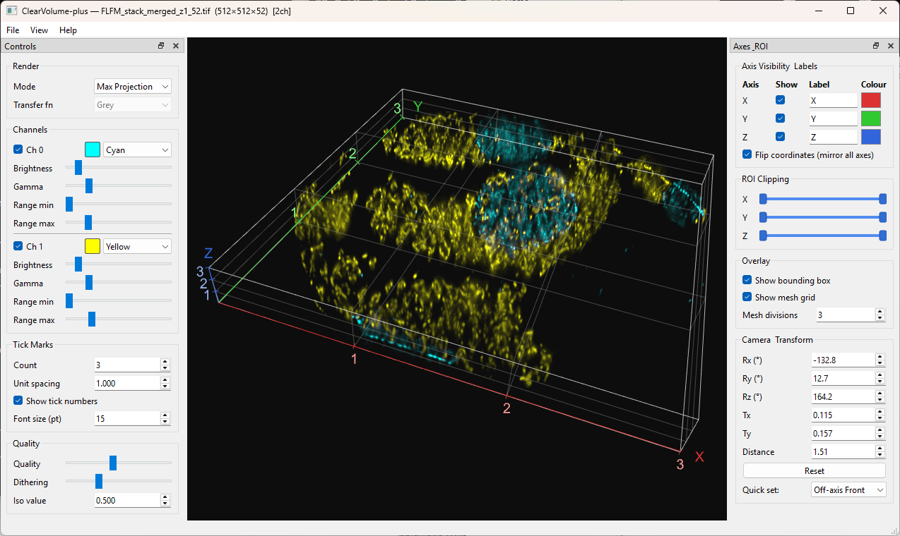

# ClearVolume-plus

### ★ Passed test on both WINDOWS and MACOS!

A Python/PyOpenGL 3D volume renderer for fluorescence microscopy TIFF stacks. Supports single-channel, multi-channel, RGB, and time-lapse volumes with real-time ray-casting in Maximum Intensity Projection (MIP) and Iso-Surface modes.

Inspired by the [ClearVolume](https://github.com/ClearVolume/ClearVolume) Fiji plugin (Java/JOGL/OpenCL), reimplemented from scratch in Python using PyOpenGL, PyQt6, and GLSL shaders.

---

## Preview



*Two-channel fluorescence volume (cyan + yellow) rendered in Maximum Intensity Projection mode, with bounding box overlay and axis labels.*

---

## Features

- **Ray-casting renderer** — GLSL fragment shader with Maximum Intensity Projection (MIP) and Iso-Surface modes
- **Multi-channel** — up to 4 independent fluorescence channels, each with its own colour, transfer function, brightness, gamma, and contrast range
- **RGB volumes** — true-colour TIFF stacks rendered with per-channel brightness control
- **Time-lapse** — frame slider, keyboard stepping, and video export (MP4 / AVI / GIF)
- **ROI clipping** — dual-handle range sliders crop the volume along X, Y, Z in texture space
- **Axis overlay** — colour-coded X/Y/Z axis lines with configurable tick marks and labels
- **Bounding box & mesh grid** overlay
- **Camera control** — mouse interaction plus precise Euler-angle / distance spinboxes
- **Coordinate flip** — mirrors all axes (useful for microscopes with inverted Z)
- **Export** — save the current view to PNG/JPEG; record time-lapses to video

## V2.0 Change logs

**(1) New Features**

* Dynamic Axis Origin: The X/Y/Z axis origin is now placed dynamically at the front-bottom-left corner of the bounding box on every frame. 
* Predefined Camera Presets: A quick-set dropdown in the Axis Panel (and a mirrored submenu under **View → Camera Preset**) provides one-click access to standard viewpoints.

* Default View on File Load: When a volume is loaded, the view automatically snaps to **Off-axis Front**, providing an immediately readable perspective without requiring manual camera adjustment.
* TIFF Export: The **File → Export Visualization** dialog now supports TIFF in addition to PNG and JPEG.

* Drag-and-Drop File Loading: Volume files (`.tif`, `.tiff`, `.raw`) can be loaded by dragging them directly onto the application window.
* Tick Marks Independent of Axis Line Visibility: Tick marks are now drawn even when the axis line itself is hidden. 

**(2) Improvements**

* Axis Label Placement — Outside the Bounding Box: Axis letter labels (X, Y, Z) and tick number labels are now always rendered outside the bounding box. 
* Label-to-Axis Gap Scales with Font Size: Label and tick number gaps now scale proportionally with the rendered font size.
* Axis Font Size Control Moved to Tick Marks Tab: The font size control is now a spinbox (range 6–32 pt) inside the **Tick Marks** group in the left Controls panel.
* Coordinate Flip Merged into Axis Labels Group: The "Flip coordinates" checkbox has been moved into the **Axis Labels** group in the right Axis Panel.
* Tick Marks Group Moved to Left Panel: The Tick Marks controls now live in the left Controls panel, balancing the left/right dock widths.
* Brighter Default Render on Load: Range max is initialized to 0.5 (50 % of the normalized range) on every volume load.
* Proportional Zoom: Scroll-wheel zoom is now proportional rather than additive, giving smooth, consistent zoom speed at any distance.
* Smooth Font Rendering — No Glyph Corruption: All axis and tick labels are rendered using `QPainterPath.addText()` (filled vector outlines) instead of `QPainter.drawText()`.

---

## Requirements

| Package | Version |
|---------|---------|
| Python | ≥ 3.9 |
| PyQt6 | ≥ 6.4.0 |
| PyOpenGL | ≥ 3.1.6 |
| PyOpenGL_accelerate | ≥ 3.1.6 |
| tifffile | ≥ 2023.1.1 |
| numpy | ≥ 1.24.0 |
| imageio | ≥ 2.28.0 *(optional — video recording)* |
| imageio-ffmpeg | ≥ 0.4.8 *(optional — MP4/AVI output)* |

A GPU with OpenGL 3.3 Core Profile support is required (any discrete GPU or modern integrated GPU from the last decade qualifies).

---

## Installation

### 1. Clone the repository

```bash
git clone https://github.com/your-username/clearvolume-plus.git
cd clearvolume-plus
```

### 2. Create a virtual environment (recommended)

```bash
# macOS / Linux
python3 -m venv .venv
source .venv/bin/activate

# Windows
py -m venv .venv
.venv\Scripts\activate
```

### 3. Install dependencies

```bash
pip install -r requirements.txt
```

> **Windows note:** PyOpenGL_accelerate requires a C compiler. If the install fails, omit that line from `requirements.txt` — the application will still run, just slightly slower. Alternatively, install a pre-built wheel from [Christoph Gohlke's site](https://www.lfd.uci.edu/~gohlke/pythonlibs/).

---

## Running the Application

Run from the project root directory:

```bash
# macOS / Linux
python3 run.py

# Windows
py run.py
```

To open a TIFF file directly on launch:

```bash
# macOS / Linux
python3 run.py path/to/volume.tif

# Windows
py run.py path/to/volume.tif
```

The window opens at 1100 × 720 px and is freely resizable. Both dock panels can be detached, hidden, or resized.

---

## Interface Overview

The window has three areas:

```
┌─────────────┬──────────────────────┬──────────────┐
│  Controls   │                      │  Axes & ROI  │
│  (left)     │    3D Viewport       │  (right)     │
│             │                      │              │
└─────────────┴──────────────────────┴──────────────┘
```

| Panel | Keyboard shortcut | Description |
|-------|-------------------|-------------|
| Controls (left) | `Ctrl+Shift+C` | Render mode, transfer functions, per-channel sliders, quality |
| 3D Viewport (centre) | — | Interactive OpenGL render surface |
| Axes & ROI (right) | `Ctrl+Shift+A` | Axis labels, ROI clipping, overlay, camera spinboxes |

---

## Loading Files

Use **File → Open** (`Ctrl+O`) or pass a path on the command line.

### Supported formats

| Format | Extensions | Notes |
|--------|-----------|-------|
| TIFF stack | `.tif`, `.tiff` | Single-channel, multi-channel (ZCYX / TZCYX), RGB (ZYXC), time-lapse |
| Raw binary | `.raw` | Manually specify dimensions after loading |

The loader auto-detects the axis layout from the TIFF metadata and array shape. If the detection is wrong, use **File → Reinterpret Volume Type…** to override it:

| Interpretation | Axis layout |
|----------------|-------------|
| Multi-channel | Z C Y X |
| Time-lapse | T Z Y X |
| Time-lapse multi-channel | T Z C Y X |
| RGB volume | Z Y X 3 |
| Time-lapse RGB | T Z Y X 3 |

Large files that exceed the memory limit are loaded **lazily** — only the current time frame is kept in RAM.

---

## Mouse Controls

| Gesture | Action |
|---------|--------|
| Left-drag | Rotate (arcball) |
| Right-drag | Pan |
| Scroll wheel | Zoom in / out |
| `Ctrl` + left-drag | Adjust intensity range (channel 0) |
| `Shift` + left-drag | Adjust gamma (channel 0) |
| Double-click | Toggle full-screen |

---

## Keyboard Shortcuts

| Key | Action |
|-----|--------|
| `I` | Cycle render mode (MIP ↔ Iso-Surface) |
| `R` | Reset rotation, translation, and zoom |
| Arrow keys | Pan (hold `Shift` for larger steps) |
| `[` / `]` | Step time-lapse −1 / +1 frame |
| `F11` | Toggle full-screen |
| `Esc` | Exit full-screen |
| `Ctrl+O` | Open file |
| `Ctrl+E` | Export current view as PNG |
| `Ctrl+Q` | Quit |

The full list is also available from **Help → Keyboard Shortcuts**.

---

## Controls Panel (left dock)

### Render

| Control | Description |
|---------|-------------|
| **Mode** | Switch between *Max Projection* (MIP) and *Iso-Surface* |
| **Transfer fn** | Colour look-up table for single-channel volumes (Grey, Green, Red, Blue, Cyan, Magenta, Yellow, Hot, Fire, Ice, Cool-Warm, Rainbow) |

### Channels *(multi-channel volumes only)*

One section per channel, each with:

| Control | Description |
|---------|-------------|
| Checkbox (`Ch N`) | Toggle channel visibility |
| Colour button | Pick a custom channel colour (generates a matching transfer function) |
| Transfer fn dropdown | Per-channel colour LUT |
| **Brightness** | Overall output brightness multiplier (default 1.0) |
| **Gamma** | Power-law intensity correction — values < 1 brighten shadows, > 1 increase contrast |
| **Range min / max** | Clip the normalised intensity window [0, 1] to enhance contrast |

### Intensity *(single-channel and RGB volumes)*

| Control | Description |
|---------|-------------|
| **Brightness** | Output brightness multiplier. For RGB volumes this scales all three colour channels equally. |
| **Gamma** | Power-law correction *(hidden for RGB volumes — not applicable)* |
| **Range min / max** | Intensity window *(hidden for RGB volumes)* |

### Quality

| Control | Description |
|---------|-------------|
| **Quality** | Ray-marching step count (0.1 = fast/coarse, 1.0 = slow/fine) |
| **Dithering** | Random jitter on ray start to reduce banding artefacts |
| **Iso value** | Intensity threshold for Iso-Surface mode |

### Time *(time-lapse volumes only)*

| Control | Description |
|---------|-------------|
| Frame slider | Jump to any time point |
| **● Rec** button | Start recording a video of all frames (MP4 / AVI / GIF) |
| **■ Stop** button | Finish recording early |

---

## Axes & ROI Panel (right dock)

### Axis Visibility & Labels

Toggle each axis line on or off, rename the label, and change its colour independently for X, Y, and Z.

### Tick Marks

| Control | Description |
|---------|-------------|
| **Count** | Number of tick marks per axis (0 to hide all ticks) |
| **Unit spacing** | Physical value between consecutive ticks (e.g. µm per tick) |
| **Show tick numbers** | Toggle numeric labels next to each tick mark |

### ROI Clipping

Three dual-handle range sliders (X, Y, Z) crop the visible region of the volume in texture space [0 %, 100 %]. Dragging the left handle sets the near clip; dragging the right handle sets the far clip. The bounding box and axis overlay update in real time.

### Overlay

| Control | Description |
|---------|-------------|
| **Show bounding box** | Wire-frame box outlining the full volume extent |
| **Show mesh grid** | Subdivided grid on the bounding box faces |
| **Mesh divisions** | Number of grid subdivisions (2–20) |

### Transform

| Control | Description |
|---------|-------------|
| **Flip coordinates** | Mirror all three axes — useful when the microscope Z-axis points downward |

### Camera & Transform

Precise numeric control over the camera, updated in real time as you drag the mouse:

| Spinbox | Description |
|---------|-------------|
| **Rx / Ry / Rz (°)** | Euler rotation angles |
| **Tx / Ty** | Screen-space translation |
| **Distance** | Camera distance from the volume centre |
| **Reset** | Restore the default view for the loaded volume |

---

## Exporting

### Still image

**File → Export Visualization…** (`Ctrl+E`) saves the current viewport (including axis overlay) as PNG or JPEG. The default save location is the `export/` folder in the project root.

### Time-lapse video

1. Load a time-lapse TIFF.
2. In the **Time** group of the Controls panel, click **● Rec**.
3. Choose an output path (MP4, AVI, or GIF).
4. ClearVolume-plus renders each frame in sequence and writes the video automatically. Click **■ Stop** to finish early.

> **Requires** `imageio` and `imageio-ffmpeg`. Install with:
> ```bash
> pip install imageio imageio-ffmpeg
> ```

---

## Running Tests

```bash
python3 -m pytest tests/ -v
```

Test files in `testdata/` are detected automatically; tests that require specific TIFF files are skipped with a clear message if the file is absent.

---

## Project Structure

```
clearvolume-plus/
├── run.py                       # Entry point
├── requirements.txt
├── scr/                         # Python package
│   ├── main.py
│   ├── gui/                     # PyQt6 GUI (MainWindow, GLViewport, panels)
│   ├── renderer/                # OpenGL renderer + GLSL shaders
│   ├── volume/                  # Volume container + TIFF loader
│   ├── overlay/                 # Bounding box overlay
│   ├── controller/              # Mouse / keyboard interaction
│   └── utils/                   # Quaternion, matrix, math helpers
├── testdata/                    # Sample TIFF stacks
├── tests/                       # pytest test suite
├── screenshot/                  # Interface screenshots
└── export/                      # Default location for exported images/videos
```

---

## License

MIT License. See [LICENSE](LICENSE).

## References
[ClearVolume – Open-source live 3D visualization for light sheet microscopy.](http://www.nature.com/nmeth/journal/v12/n6/full/nmeth.3372.html) 

Loic A. Royer, Martin Weigert, Ulrik Günther, Nicola Maghelli, Florian Jug, Ivo F. Sbalzarini, Eugene W. Myers , Nature Methods 12, 480–481 (2015) doi:10.1038/nmeth.3372
